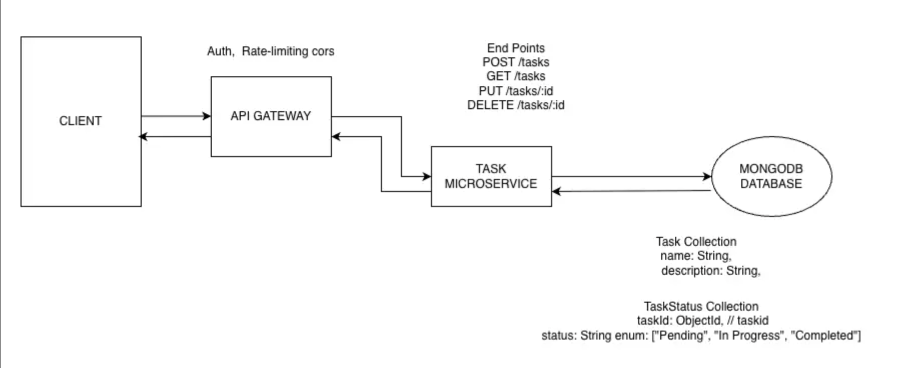

# API Documentation

The **Tasks API** is a simple microservice that allows users to create, retrieve, update, and delete tasks.  
It follows RESTful design principles and supports task status tracking with validation and structured responses.


## Architectural Diagram




 ## Endpoints**

 ### Base URL
**http://localhost:4000/tasks**

| Method | Endpoint | Description       |
|--------|-----------|------------------|
| `POST` | `/`       | Create new task  |
| `GET`  | `/`       | Get all tasks    |
| `PUT`  | `/:id`    | Update a task    |
| `DELETE` | `/:id`  | Delete a task    |


## Create Task
### POST /tasks 

Request Body

```json
{
  "name": "create a log",
  "description": "create a log for node js api",
  "status": "In Progress"
}
```

| **Field** | **Type** | **Required** | **Description** |
|------------|-----------|---------------|-----------------|
| `name` | string | Yes | Updated name |
| `description` | string | Yes | Updated details |
| `status` | string | No | Enum: `"Pending"`, `"In Progress"`, `"Completed"` <br>_Default_: `"Pending"` |


Response (201 Created)
```json
{
  "id": "690ffe1cb258585cae1e89ab",
  "name": "Design Homepage",
  "description": "Create UI mockup for homepage",
  "status": "In Progress",
}
```

 Error Response (400)
 ```json
{
  "message": "Name is required"
}
```

 ## Get All Tasks

### GET /tasks

 Response (200 OK)
 ```json
[
  {
    "id": "690ffe1cb258585cae1e89ab",
    "name": "Design Homepage",
    "description": "Create UI mockup for homepage",
    "status": "In Progress"
  },
  {
    "id": "673a45fbc21fa91f23859a15",
    "name": "Backend API",
    "description": "Develop REST APIs for tasks",
    "status": "Pending"
  }
]
```

 ## Update Task

### PUT /tasks/:id 

Request
PUT /tasks/690ffe1cb258585cae1e89ab

 Request Body
 ```json
{
  "name": "make tea",
  "description": "Make tea without sugar",
  "status": "Completed"
}
```

Field || Type || Required || Description
name  || string || yes || Updated name
description || string || yes || Updated details
status || string || no || "Pending", "In Progress", "Completed"

Response (200 OK)
```json
{
  "id": "690ffe1cb258585cae1e89ab",
  "name": "make a coffee",
  "description": "make a coffee without sugar",
  "status": "Completed",
}
```

Error Response (404)
```json
{
  "message": "Task not found"
}
```
  ## Delete Task

### DELETE /tasks/:id

 Request
DELETE /tasks/690ffe1cb258585cae1e89ab

 Response (200 OK)
 ```json
{
  "message": "Task Deleted Successfully"
}
```

Error Response (404)
```json
{
  "message": "Task not found"
}
```

 ## Collections

 ### Task 

  - **name: String**
  - **description: String**


 ### Taskstatus 

  - **taskId: ObjectId, // taskid**
  - **status: String** ***enum: ["Pending", "In Progress", "Completed"]*** ***default: "Pending"***
   

 ## Validation Rules

| **Field** | **Rule** |
|------------|-----------|
| `name` | Required |
| `description` | Required |
| `status` | Optional, but must be one of `"Pending"`, `"In Progress"`, or `"Completed"` |
| `id` (in URL) | Must be a valid MongoDB ObjectId |
 
